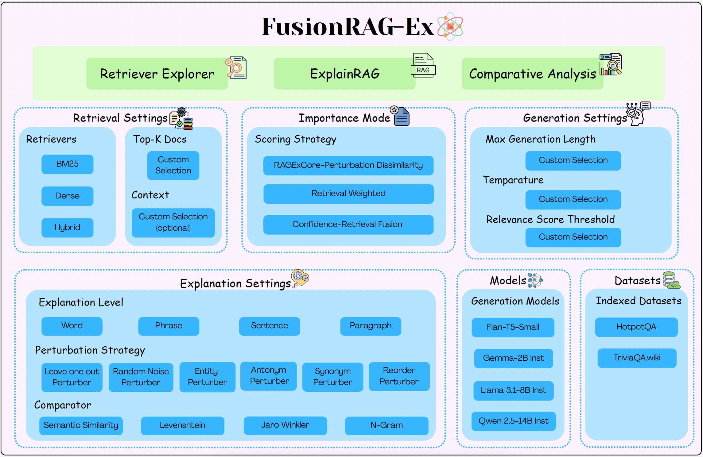

<div align="center">

# FusionRAG-Ex🚀

### An Interactive RAG Framework with Retrieval and Confidence-Aware Explanations

[](https://huggingface.co/spaces/RAG-KDDLab/XAI_RAG)
[](https://www.youtube.com/watch?v=DpALH3pYBq4)
[](https://www.python.org/)
[](https://fastapi.tiangolo.com/)
[](https://github.com/facebookresearch/faiss)
[](https://github.com/dorianbrown/rank_bm25)
[](LICENSE)

</div>

---

FusionRAG-Ex is an open-source, explainability-first Retrieval-Augmented Generation (RAG) framework. It combines **three retrieval strategies** (BM25, Dense/FAISS, Hybrid) with **three importance-scoring modes** — Perturbation Dissimilarity (PD), Retrieval-Weighted (RW), and Confidence-Retrieval Fusion — to give researchers and practitioners transparent, unit-level explanations of *why* a RAG pipeline produces any given answer.

The framework ships with a fully interactive web UI, a multi-dataset evaluation pipeline, and a simple JSONL-based data format that lets you plug in **any custom document corpus** and get up and running in minutes.

---

## 📖 Table of Contents

- [✨ Key Features](#-key-features)
- [🏗️ Architecture](#️-architecture)
- [🚀 Getting Started](#-getting-started)
  - [Prerequisites](#prerequisites)
  - [Installation](#installation)
  - [Environment Configuration](#environment-configuration)
- [📦 Data Preparation](#-data-preparation)
  - [Document JSONL Format](#document-jsonl-format)
  - [Answer / Gold-Truth JSONL Format](#answer--gold-truth-jsonl-format)
  - [Built-in Datasets](#built-in-datasets)
- [🔨 Building Indices](#-building-indices)
- [▶️ Running the Server](#️-running-the-server)
- [🖥️ Web Interface](#️-web-interface)
- [📡 API Reference](#-api-reference)
- [📊 Evaluation](#-evaluation)
- [⚙️ Configuration](#️-configuration)
- [🏷️ License](#️-license)
- [❤️ Acknowledgements](#️-acknowledgements)

---

## ✨ Key Features

| Feature | Details |
|---|---|
| **Three retrieval strategies** | BM25 (sparse), Dense FAISS (dense), Hybrid (score fusion) |
| **Three importance modes** | Perturbation Dissimilarity (PD), Retrieval-Weighted (RW), Confidence-Retrieval Fusion |
| **Flexible text splitting** | Sentence, word, phrase (noun-chunks), paragraph |
| **Rich perturbation suite** | Leave-One-Out, Random Noise, Entity, Antonym, Synonym, Reorder |
| **Multiple comparators** | Levenshtein, Jaro-Winkler, N-gram, Semantic (SBERT cosine) |
| **Multi-dataset support** | HotpotQA, TriviaQA, or any custom JSONL corpus |
| **Plug-and-play indexing** | One command builds both BM25 and FAISS indices from any JSONL file |
| **Automatic evaluation** | Recall@K, Precision@K, MRR, MAP, NDCG@K across all retriever modes |
| **Interactive web UI** | ExplainRAG tab + Comparative Analysis tab with per-mode context highlights |
| **REST API** | FastAPI backend, fully documented at `/docs` |

---

## 🏗️ Architecture

<div align="center">
  
</div>

The system is structured around four interacting layers:

1. **Retrieval Layer** — Routes queries to BM25, Dense (FAISS + SBERT), or Hybrid retriever. Each document is scored and returned with a softmax-normalised retrieval weight.
2. **Perturbation Layer** — Splits the retrieved context into units (sentences / words / phrases / paragraphs) and systematically perturbs them to probe their influence on the generated answer.
3. **Scoring Layer** — Computes per-unit importance under three modes: PD (perturbation dissimilarity only), RW (retrieval-weighted), and Fusion (confidence × retrieval weight blend controlled by α).
4. **Explanation Layer** — Aggregates scores, highlights context, and renders the web UI / API responses with full score breakdowns.

---

## 🚀 Getting Started

### Prerequisites

- Python ≥ 3.8
- A CUDA-capable GPU is recommended for dense retrieval (CPU mode also works with `faiss-cpu`)
- Conda (recommended) or `venv`

### Installation

```bash
# 1. Clone the repository
git clone https://github.com/chandanasreemala/XAI_RAG.git
cd XAI_RAG/version_2

# 2. Create and activate a conda environment
conda create -n ragex python=3.9 -y
conda activate ragex

# 3. Install dependencies
pip install -r requirements.txt

# 4. Download the spaCy English model (used for sentence / phrase splitting)
python -m spacy download en_core_web_sm
```

### Environment Configuration

Create a `.env` file inside `version_2/` (never commit this file):

```ini
# Hugging Face token — required for gated models
HF_TOKEN=hf_xxxxxxxxxxxx

# Generator model (any causal / seq2seq HF model) (This is a default model)
HF_MODEL=google/flan-t5-large

# Sentence-transformer model for dense retrieval (This is a default model)
SBERT_MODEL=sentence-transformers/all-mpnet-base-v2
```

---

## 📦 Data Preparation

FusionRAG-Ex uses a straightforward **JSONL** format for all corpora. Each line is a self-contained JSON object. Providing documents in this format is all you need to build indices and run evaluation.

### Document JSONL Format

Each line represents one **passage / chunk** from your knowledge base:

```jsonl
{"id": "doc_001", "text": "Paris is the capital of France and one of the most visited cities in the world.", "meta": {"source": "wikipedia", "title": "Paris"}}
{"id": "doc_002", "text": "The Eiffel Tower was constructed between 1887 and 1889 as the entrance arch for the 1889 World's Fair.", "meta": {"source": "wikipedia", "title": "Eiffel Tower"}}
```

| Field | Type | Required | Description |
|---|---|---|---|
| `id` | `string` | ✅ | Unique passage identifier |
| `text` | `string` | ✅ | Full text of the passage |
| `meta` | `object` | optional | Arbitrary metadata (title, source, URL, etc.) |

> **Tip:** Keep each passage to 100–300 words for best retrieval granularity. Longer documents can be pre-chunked using any standard sentence splitter.

### Answer / Gold-Truth JSONL Format

Used only for **offline evaluation**. Each line links a question to its supporting documents:

```jsonl
{"question_id": "q_001", "question": "What is the capital of France?", "answer": "Paris", "supporting_doc_ids": ["doc_001", "doc_002"]}
{"question_id": "q_002", "question": "When was the Eiffel Tower built?", "answer": "1887–1889", "supporting_doc_ids": ["doc_002"]}
```

| Field | Type | Required | Description |
|---|---|---|---|
| `question_id` | `string` | ✅ | Unique question identifier |
| `question` | `string` | ✅ | The query string |
| `answer` | `string` | optional | Expected answer (for generation evaluation) |
| `supporting_doc_ids` | `list[string]` | ✅ | Gold relevant document IDs (for retrieval metrics) |

### Built-in Datasets

The following pre-processed datasets are supported out of the box. Place the files under `version_2/data/<dataset>/`:

| Dataset | Files | Notes |
|---|---|---|
| **HotpotQA** | `hotpot_docs.jsonl`, `hotpot_answers.jsonl` | Multi-hop QA, 83k+ passages |
| **TriviaQA** | `trivia_docs.jsonl`, `trivia_answers.jsonl` | Open-domain QA, ~6k passages |

To add your own dataset, drop two JSONL files (docs + answers) in `data/<your_dataset>/` and pass the path to the index builder.

---

## 🔨 Building Indices

Once you have a `<name>_docs.jsonl` file ready, build **both** the FAISS dense index and the BM25 index with a single command:

```bash
# From version_2/
python -m scripts.build_index data/<your_dataset>/<name>_docs.jsonl
```

This produces two files in the same directory as the input:
- `<name>_faiss.index` — FAISS flat-L2 dense vectors (SBERT embeddings)
- `<name>_bm25.pkl` — serialised BM25 model

**Examples:**

```bash
# HotpotQA
python -m scripts.build_index data/hotpot/hotpot_docs.jsonl

# TriviaQA
python -m scripts.build_index data/trivia/trivia_docs.jsonl

# Custom corpus — output written to data/mycorpus/
python -m scripts.build_index data/mycorpus/mycorpus_docs.jsonl data/mycorpus
```

After indexing, the server will automatically discover the new dataset on startup via the `/datasets` endpoint.

---

## ▶️ Running the Server

### Quick start (recommended)

```bash
cd version_2
./run_server_v2.sh          # starts on port 8000
./run_server_v2.sh 8001     # starts on port 8001
```

### Manual start

```bash
cd version_2

# GPU (recommended)
CUDA_VISIBLE_DEVICES=0 uvicorn app.api:app --reload --reload-dir app --port 8000 --host 0.0.0.0

# CPU only
uvicorn app.api:app --reload --port 8000 --host 0.0.0.0
```

> **Note:** `--host 0.0.0.0` makes the server reachable from other machines on the same network.  
> Find your local IP with `hostname -I | awk '{print $1}'`.  
> To expose it publicly, use [ngrok](https://ngrok.com/): `ngrok http 8000`

---

## 🖥️ Web Interface

Once the server is running, open your browser at:

```
http://localhost:8000/static/index.html
```

The UI provides two main tabs:

### Retriever Explorer Tab
- Enter a question and select one or more retrievers, that you want to compare.
- Retrieved documents along with the shared common docs across all retrievers are shown.  

### ExplainRAG Tab
- Enter a question and select retriever, importance mode, perturbation strategy, and comparator.
- View the retrieved context with **per-mode token highlights** (top-33% most important units highlighted).
- Inspect full score breakdowns and a colour-coded importance map.

### Comparative Analysis Tab
- Run the same question under all three importance modes **simultaneously**.
- The *Full Context Used* section renders **three side-by-side highlighted panels** — one for PD, one for RW, one for Fusion — so you can directly compare which units each mode considers most influential.
- A ranked unit table shows PD / RW / Fusion scores side by side with retrieval weights.

---

## 📡 API Reference

The full interactive API documentation is available at `http://localhost:8000/docs` (Swagger UI).

### Core Endpoints

| Method | Endpoint | Description |
|---|---|---|
| `GET` | `/health` | Liveness check |
| `GET` | `/models` | List loaded models |
| `GET` | `/datasets` | List available indexed datasets |
| `POST` | `/switch-dataset` | Hot-swap the active dataset |
| `POST` | `/retrieve` | Retrieve top-K documents for a query |
| `POST` | `/retrieve/compare` | Compare retrieval results across BM25 / Dense / Hybrid |
| `POST` | `/explain` | Full RAG explain request (single importance mode) |
| `POST` | `/compare` | Comparative analysis (all three importance modes) |

### Example: `/explain`

```json
POST /explain
{
  "question": "What river runs through Paris?",
  "retriever": "hybrid",
  "top_k_docs": 3,
  "perturber": "leave_one_out",
  "unit": "sentence",
  "comparator": "semantic",
  "importance_mode": "ragex_core",
  "alpha": 0.5
}
```

| Parameter | Options | Default | Description |
|---|---|---|---|
| `retriever` | `bm25`, `dense`, `hybrid` | `hybrid` | Retrieval strategy |
| `top_k_docs` | any int | `3` | Number of documents to retrieve |
| `perturber` | `leave_one_out`, `random_noise`, `entity_perturber`, `antonym_perturber`, `synonym_perturber`, `reorder_perturber` | `leave_one_out` | Perturbation method |
| `unit` | `sentence`, `word`, `phrase`, `paragraph` | `sentence` | Text splitting granularity |
| `comparator` | `levenshtein`, `jaro_winkler`, `n_gram`, `semantic` | `semantic` | Answer similarity measure |
| `importance_mode` | `ragex_core`, `retrieval_weighted`, `confidence_retrieval_fusion` | `ragex_core` | Scoring formula |
| `alpha` | `0.0` – `1.0` | `0.5` | Fusion blend (higher = more weight on retrieval confidence) |

---

## 📊 Evaluation

FusionRAG-Ex includes a full offline retrieval evaluation pipeline. When gold truths (`supporting_doc_ids`) are provided in the answers JSONL, the script computes **Recall@K, Precision@K, MRR, MAP, and NDCG@K** across all three retrievers.

```bash
# From version_2/ — evaluate on up to 5000 samples per dataset
python scripts/eval_retrieval_multi.py \
    --n_samples 5000 \
    --k_docs 3 \
    --datasets hotpot trivia \
    --output_dir results/retrieval
```

**Arguments:**

| Argument | Default | Description |
|---|---|---|
| `--n_samples` | `1000` | Maximum queries to evaluate per dataset |
| `--k_docs` | `3` | Primary K for evaluation |
| `--datasets` | `hotpot trivia` | Space-separated list of dataset names |
| `--output_dir` | `results/retrieval` | Directory for output files |

**Output files (per dataset):**

| File | Description |
|---|---|
| `<dataset>_per_query_results.csv` | Per-query metrics for every retriever |
| `<dataset>_summary_metrics.csv` | Aggregated mean ± std per retriever |
| `<dataset>_bar_comparison.png` | Bar chart: Recall / MRR / MAP / NDCG per retriever |
| `<dataset>_boxplot_ndcg.png` | NDCG@K distribution (box plot) |
| `<dataset>_boxplot_mrr.png` | MRR distribution (box plot) |
| `<dataset>_recall_vs_k.png` | Recall@K curve (K = 1 … 10) |
| `cross_dataset_comparison.png` | Side-by-side bar chart across all datasets |

**Sample results (1000 queries):**

| Dataset | Best Retriever | NDCG@3 | Recall@3 | MRR |
|---|---|---|---|---|
| HotpotQA | **Hybrid** | 0.779 | 0.559 | 0.758 |
| TriviaQA | **Dense** | 0.808 | 0.773 | 0.799 |

---

## ⚙️ Configuration

All runtime settings live in `version_2/app/config.py` and are loaded from the `.env` file and environment variables. Key settings:

| Setting | Env var | Description |
|---|---|---|
| Generator model | `HF_MODEL` | HuggingFace model ID for answer generation |
| SBERT model | `SBERT_MODEL` | Sentence-transformer for dense retrieval & semantic comparison |
| HF token | `HF_TOKEN` | Required for gated / private HF models |
| Data directory | `DATA_DIR` | Root directory for JSONL files and indices (default: `data/`) |
| Default dataset | `DEFAULT_DATASET` | Dataset loaded on server start |

---

## 🏷️ License

This project is licensed under the **MIT License**. See the [LICENSE](LICENSE) file for details.

---

## ❤️ Acknowledgements

This project builds on the following excellent open-source libraries:

- [FAISS](https://github.com/facebookresearch/faiss) — efficient dense vector search
- [rank-bm25](https://github.com/dorianbrown/rank_bm25) — BM25 retrieval
- [sentence-transformers](https://github.com/UKPLab/sentence-transformers) — dense text embeddings
- [FastAPI](https://github.com/tiangolo/fastapi) — high-performance REST API framework
- [spaCy](https://github.com/explosion/spaCy) — sentence and noun-chunk splitting
- [HotpotQA](https://hotpotqa.github.io/) and [TriviaQA](https://nlp.cs.washington.edu/triviaqa/) — evaluation benchmarks
